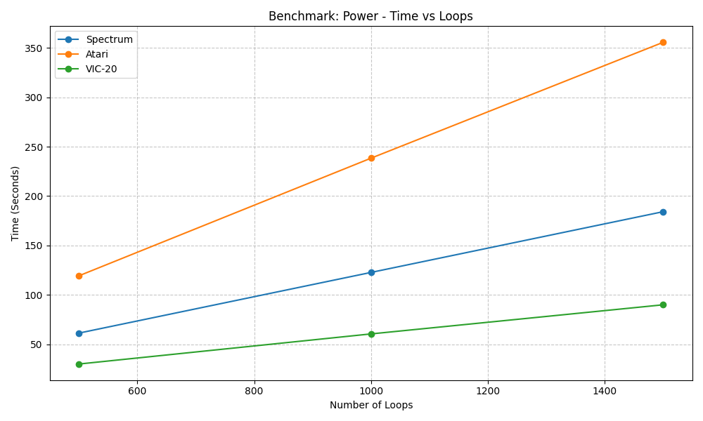
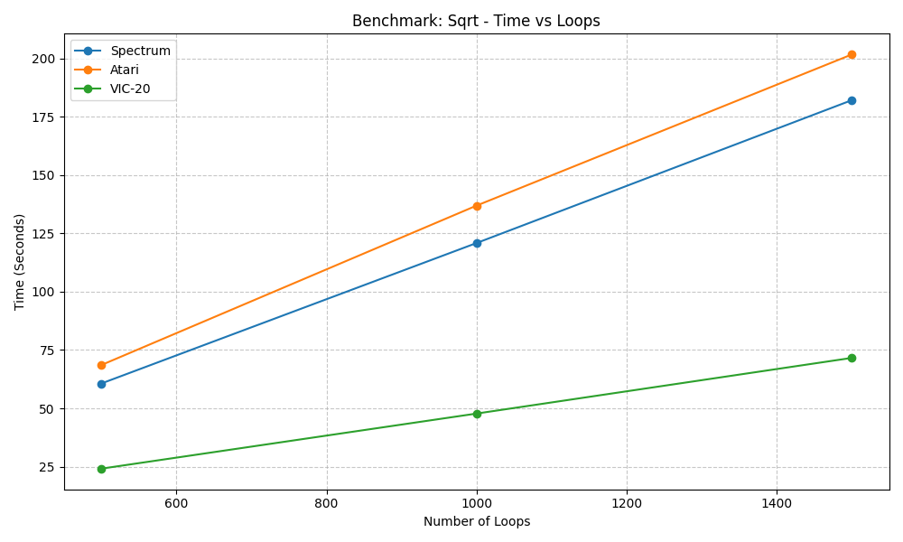
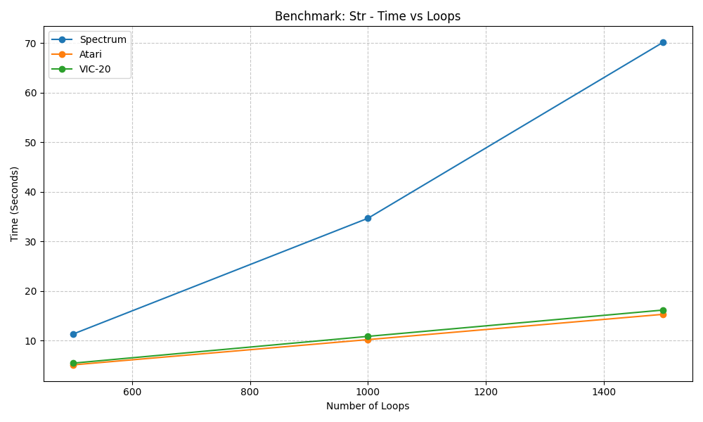
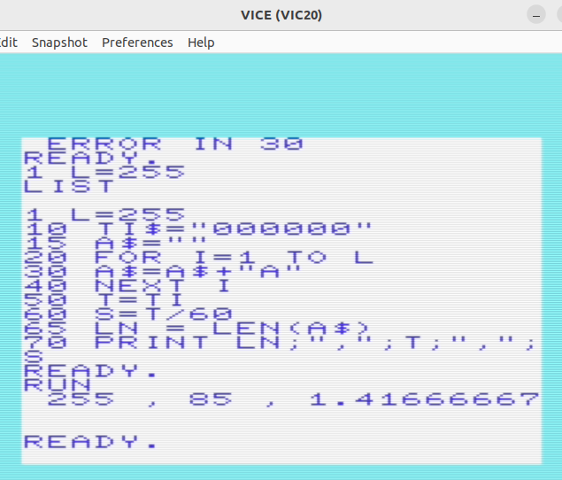
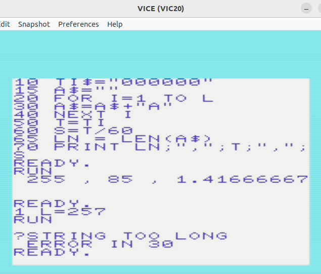

# RetroComutersBenchmark
## Computer history course project

### In this project I have done several tests on the following computers: 
- **ZX Spectrum**
- **Atari 800**
- **Commodore VIC-20**

### I have conducted 4 different tests:
1. Default for loop:
```BASIC
10 LET A=0
20 FOR I=1 TO $LOOPS
30   LET A=A + 1
40 NEXT I
```

2. Raising numbers to the power of `1.234`
```BASIC
10 LET A=0
20 FOR I=1 TO $LOOPS
30   LET X= I ^ 1.234
40   LET A=A + X
50 NEXT I
```

3. Calculation of square root
```BASIC
10 LET A=0
20 FOR I=1 TO $LOOPS
30   LET A = A + SQR(I)
40 NEXT I
```

4. String concatenation
```BASIC
10 LET A\$ = ""
20 FOR I=1 TO $LOOPS
30   LET A\$ = A\$ + "A"
40 NEXT I
```

## Results








For default `for` loop I run script for `500`,`1000`,`1500`,`5000`,`1000` iterations, and all other only for `500`,`1000`,`1500` iterations.


From images above we can see that **Atari 800** is slowest one and  **Commodore VIC-20** - fastest everywhere except from string concatenation


### Remarks

`benchmark.sh` - main script for testing **ZX Spectrum** and **Atari 800**, where I can configure needed parameters, create `BASIC` scripts and run tests.

`run_all.sh` - just utilizes `benchmark.sh` and runs all needed tests at once

I haven't automated testing for **Commodore VIC-20**, so I was performing tests from console.

All `BASIC` scripts are in `vic-20-scripts` directory.

All screenshot proofs of **Commodore VIC-20** tests are in `vic-20-results` directory

### **Commodore VIC-20** String concatenation nuance:

#### I have faced string size overflow while testing string concatenation, so I have modified script for this task on this computer, so when my string's length reaches `255`, I reset my string, to avoid this error






So here is part of my modified code:

```python
10 A$=""
20 FOR I=1 TO L
30   A$=A$+"A"
35   IF LEN(A$) = 255 THEN A$="" # Added this line to reset string
40 NEXT I
```

`benchmark.sh` writes results into `benchmark results.csv`, but I have created `all_results.csv` and also added there results for **Commodore VIC-20**

Unfortunately no results for Tandy **Tandy TRS-80 Model I**
